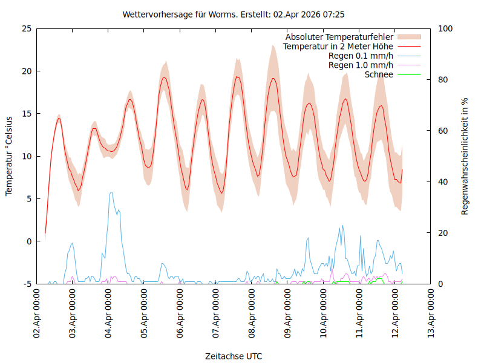

# Wettervorhersage
für Worms erstellt am: heute

Lokale Wettervorhersage mit Opendata DWD /Mosmix. Verwendetet Programme : Bash, Wetterdienst 0.79.0 und Gnuplot
# Skript ist getestet
 Shellchecked
## Vorraussetzung:
Um die Daten abzurufen verwende ich [Wetterdienst 0.79.0](https://pypi.org/project/wetterdienst/) . 
Für das Diagramm benutze ich Gnuplot "apt install gnuplot" .
## Allgemein
Mögliche Parameter und Einheiten :
wetterdienst about coverage --provider DWD --network mosmix
Stationen kann man auswählen :
https://www.dwd.de/DE/leistungen/met_verfahren_mosmix/mosmix_stationskatalog.cfg
## wetter(x).sh
konfiguriert für (x)Tage Vorraussage
Anfangs und Enddatum kann über die Variablen eingestellt werden . (maximal 10 Tage in die Zukunft)
--station=K2635 durch gewünschte Station ersetzen s.o.
## wetter1.gp
set title ersetzen
