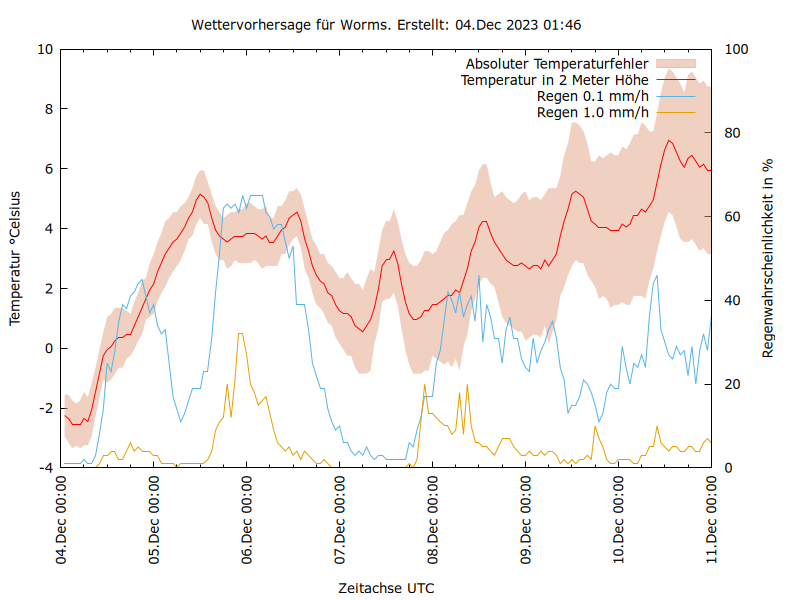

# Wettervorhersage
 Shellchecked

Lokale Wettervorhersage mit Opendata DWD /Mosmix in  Bash

## Vorraussetzung:
Um die Daten abzurufen verwende ich [Wetterdienst](https://pypi.org/project/wetterdienst/) .

Für das Diagramm benutze ich Gnuplot "apt install gnuplot" .
## Allgemein
Mögliche Parameter und Einheiten :

wetterdienst about coverage --provider DWD --network mosmix

Stationen kann man auswählen :

https://www.dwd.de/DE/leistungen/met_verfahren_mosmix/mosmix_stationskatalog.cfg

## wetter1.sh
konfiguriert für eine 48-Stundenvorhersage.
Bleibt die Klammer leer [] werden ca. 10 Tage Vorhersage geladen 
--station=K2635 durch gewünschte Station ersetzen s.o.

## wetter1.gp
set title ersetzen
